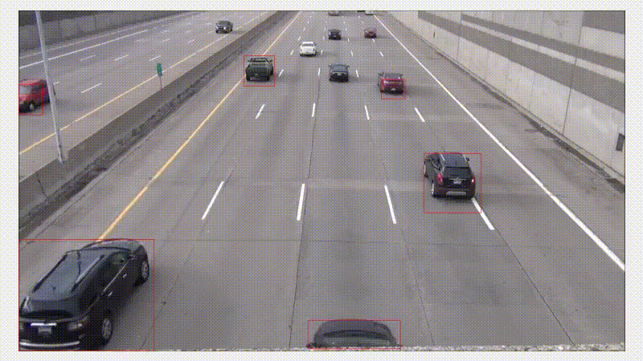
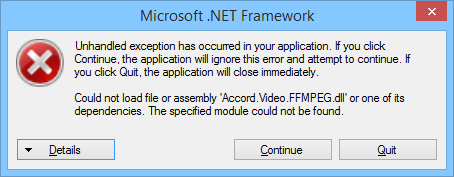

# CarsTracking

CarsTracking is a motion detection sample project programmed on pure C# without using any image analysis/processing libraries such as OpenCV. The motivation for this project is to try to implement simplified motion detection from scratch using own ideas and understanding of the problem. The project can be optimized even further by replacing .NET imaging classes which are used for downscaling source frames and drawing rectangles with plain in-memory image operations.

Accord.NET is used for playing mp4 video with traffic.

## Project content
This project consists of 3 sub-projects:
* CarsTracking.UI   - simple C# .Net Windows Forms application which displays processed video frames
* MotionDetector    - .NET assembly which contains motion detection code
* VideoPlayer       - .NET assembly which plays video frame by frame

## Building
To build the project you need to have the following tools:
* Visual Studio 2017
* Microsoft .NET Framework 4.7.1 (actually, can be changed to any version supported by Accord.NET video player)

## Steps to build
Steps are very straight forward:
* Restore NuGet packages
* Build
* Run

## Note
The project is configured for x86 platform because Accord.NET requires it. The detection code itself has no platform requirements/limitations.

If you see this error

simply copy all .DLL files from CarsTracking\packages\Accord.Video.FFMPEG.3.8.0\build to BIN folder next to CarsTracking.exe

## License
Copyright (c) 2019 Roman Allen

Licensed under the Apache License, Version 2.0 (the "License");
you may not use this file except in compliance with the License.
You may obtain a copy of the License at

[http://www.apache.org/licenses/LICENSE-2.0](http://www.apache.org/licenses/LICENSE-2.0)

Unless required by applicable law or agreed to in writing, software
distributed under the License is distributed on an "AS IS" BASIS,
WITHOUT WARRANTIES OR CONDITIONS OF ANY KIND, either express or implied.
See the License for the specific language governing permissions and
limitations under the License.